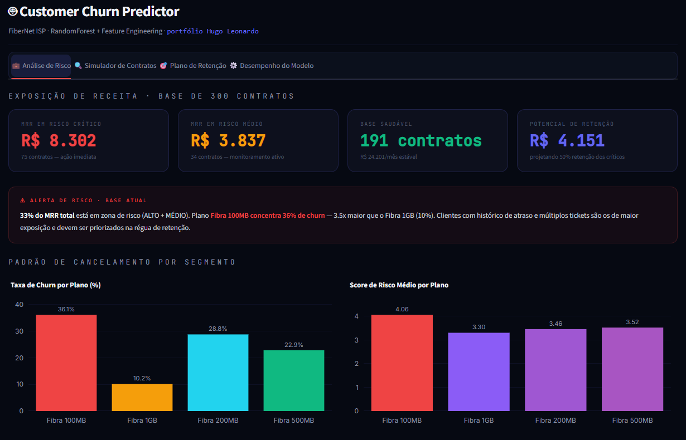
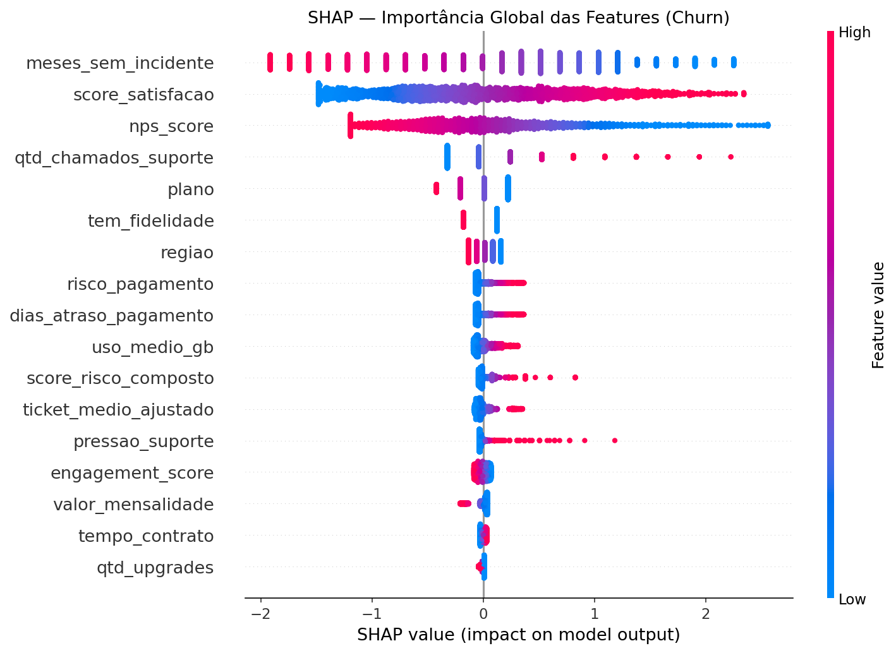
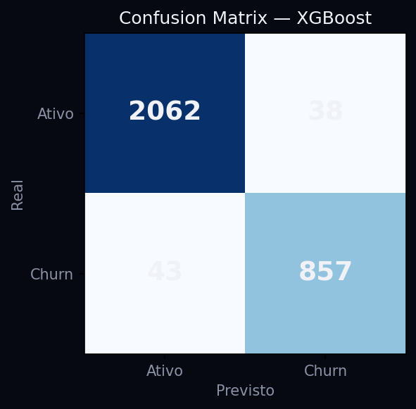
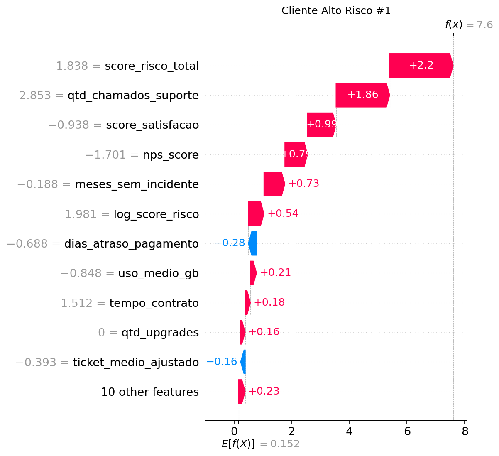

# Customer Churn Predictor — FiberNet ISP

<div align="center">


**Projeto 3 de 4 da série FiberNet Analytics.**  
Pipeline completo de ML para identificação e priorização de contratos em risco de cancelamento — do feature engineering ao plano de ação operacional.

[Ver pipeline técnico](#desempenho-dos-modelos-pipelinepy) · [Como rodar](#como-rodar)

</div>

> Peça do portfólio de **Hugo Nazário**, Analista de Dados — cada projeto, com o contexto de por que foi feito, está em **[hugonazario.com](https://hugonazario.com/)**.

---



*Aba de Análise de Risco: exposição de MRR por faixa de risco, alerta de concentração e taxa de cancelamento por plano e por região.*

---

## Universo FiberNet — Escala Canônica

Os 3 projetos desta série representam a **mesma empresa fictícia** em granularidades complementares:

| Granularidade | Projetos | Escala | Abrangência |
|---|---|---|---|
| **Amostra Regional** | SQL Analytics Pack | 300 contratos | Centro-MG: Betim, Contagem, Ribeirão das Neves, Esmeraldas, Ibirité |
| **Base de Modelagem** | **Churn Predictor** | 15.000 contratos | 5 regiões (Norte, Sul, Leste, Oeste, Centro) · planos até Empresarial |
| **Visão Operacional Nacional** | Telecom KPI Dashboard | 88.501 clientes (jan/25) | 5 regiões nacionais |

A divergência de escala é **intencional**: o SQL Pack mergulha numa amostra regional pequena, onde dá para conferir cada linha na mão. Modelo precisa de volume, então o Churn Predictor gera 15.000 contratos. O KPI Dashboard consolida a operação inteira.

**O que essas bases NÃO são: a mesma tabela.** Cada projeto gera a sua, com o seu gerador. O padrão de negócio se repete — plano de menor ticket cancela mais, atraso e insatisfação antecipam a saída — mas o número exato de um não vale como conferência do outro. Uma versão anterior deste repositório fixava as taxas de churn do app nos valores que a query 02 do SQL Pack devolve e apresentava a coincidência como prova de coerência da série. Coincidência costurada à mão não prova nada.

---

## O Problema de Negócio

Em ISPs, churn não controlado corrói o MRR silenciosamente. O desafio não é saber que clientes cancelam — é saber **quais vão cancelar antes que cancelem**, para acionar retenção com tempo hábil.

Este projeto entrega exatamente isso: uma lista priorizada de contratos por nível de risco, com MRR em exposição calculado e plano de ação definido por faixa.

---

## O Que o Analista Entrega

| Entrega | Descrição |
|---------|-----------|
| Score de risco por contrato | Probabilidade out-of-fold do RandomForest sobre 17 variáveis — pagamento, suporte, satisfação, uso e contrato |
| Segmentação ALTO / MÉDIO / BAIXO | Prioridade de ação para o time comercial e de retenção |
| MRR em risco calculado | Exposição financeira real por segmento |
| Plano de ação por faixa | Do contato proativo ao cashback de emergência |
| Lista exportável (CSV) | Pronta para uso no CRM ou régua de atendimento |

---

## Principais Achados (Base Sintética FiberNet)

> **Leia isto antes dos números.** A base é gerada, e as relações abaixo foram
> **escolhidas** no gerador — o churn por plano sai de `PLAN_FACTOR`, os pesos SHAP
> refletem a ordem em que as variáveis entram na simulação. Não são descobertas
> sobre o mercado de ISP, e citá-las como se fossem seria o mesmo erro que a seção
> "Por que 0,78 e não 0,99" descreve, uma camada acima.
>
> O que É demonstrável aqui: o pipeline recupera a estrutura que existe no dado,
> mede o quanto dela é recuperável (AUC 0,785 contra um teto imposto por 15% de
> ruído), e traduz isso em priorização com MRR em exposição. A leitura de negócio
> é o exercício; o achado de mercado teria de vir de base real.

- **Plano Fibra 100MB concentra 39,5% de churn** — 1,8× o do Empresarial (21,9%), com a
  escada completa passando por 200MB (28,3%) e 500MB (22,9%)
- **Região pesa quase tanto quanto plano**: Norte em 39,0% contra Sul em 21,2%
- **Insatisfação manda mais que inadimplência.** Cliente com NPS até 2 e pagamento em dia
  cancela em 81% dos casos; cliente com NPS 9–10 e 61 a 90 dias de atraso, em 30%. O atraso
  empilha em cima do NPS baixo (chega a 93%), mas sozinho não leva ninguém para a saída
- **Tempo de casa por si só não é protetor** — `tempo_contrato` fica em 13º de 17 na
  importância do modelo, atrás de todas as variáveis de satisfação e suporte

---

## Estrutura do Projeto

```
churn-predictor/
├── churn_data.py       ← Gerador, features e pré-processamento — fonte única
├── app.py              ← Dashboard interativo (Streamlit) — RandomForest
├── pipeline.py         ← Validação técnica: 4 modelos comparados, SHAP, threshold ótimo
├── outputs/
│   ├── predictions.csv
│   ├── relatorio_churn.md   ← Relatório completo gerado pelo pipeline
│   └── shap/                ← SHAP summary, dependência e force plots
├── tests/
│   ├── test_sanity.py       ← 21 testes: dados, correlações, modelo e fonte única
│   └── test_typical_row.py  ← 3 testes: o app não pode voltar a decidir tipo
│                              de coluna por `dtype == object` (quebra no pandas 3)
├── .streamlit/
│   └── config.toml     ← Tema alinhado ao CSS do app
├── requirements.txt        ← Só o que o app precisa (é o que o deploy instala)
└── requirements-dev.txt    ← + XGBoost, LightGBM, SHAP, pytest (pipeline e testes)
```

`churn_data.py` é o coração: `app.py` e `pipeline.py` importam dele e **nenhum dos dois
gera dado por conta própria**. Três testes garantem isso — a seção
[Um gerador, dois consumidores](#um-gerador-dois-consumidores) conta por quê.

---

## Como Rodar

### Dashboard interativo (Streamlit)

```bash
pip install -r requirements.txt
streamlit run app.py
```

Acessa em `http://localhost:8501`. O primeiro carregamento leva ~15s: gera os 15.000
contratos e treina os 6 modelos da validação out-of-fold. Depois fica em cache.

### Pipeline de Validação Técnica

```bash
pip install -r requirements-dev.txt
python pipeline.py
# Gera: outputs/relatorio_churn.md · outputs/predictions.csv · outputs/shap/*.png
```

### Testes

```bash
pip install -r requirements-dev.txt
pytest tests/ -v
```

---

## Dois Componentes, um Objetivo

Este projeto tem dois artefatos intencionalmente separados:

### `app.py` — Dashboard Interativo
- Modelo: **RandomForest** (scikit-learn), sobre o mesmo `churn_data.build_dataset`
- Foco: usabilidade, simulador interativo, plano de ação em tempo real
- As probabilidades das abas de risco são **out-of-fold**: cada contrato recebe o score do
  modelo que não o viu no treino. Probabilidade tirada do modelo que já leu a linha é
  otimista, e era ela que ordenava a lista de prioridade
- O simulador explica cada previsão por ablação: troca um valor pelo do cliente mediano da
  base e mede quanto a probabilidade cai. Antes, multiplicava importância global pelo valor
  bruto da variável — somava reais com contagem de chamados e exibia o total como
  porcentagem

### `pipeline.py` — Validação Técnica Completa
- Compara 4 modelos: Logistic Regression, RandomForest, XGBoost, LightGBM
- Modelo final: LogisticRegression — AUC 0.785, F1 0.673
- Threshold ótimo calibrado via curva Precision-Recall (0.603)
- SHAP values calculados para interpretabilidade de feature importance
- Calibração de probabilidade com isotonic regression

> O `pipeline.py` representa a profundidade técnica do projeto. O `app.py` representa a entrega para o usuário final. Ambos são parte do mesmo fluxo de trabalho analítico.

---

## Desempenho dos Modelos (pipeline.py)

| Modelo | CV AUC (μ) | AUC-ROC | F1 | Precisão | Recall | Brier |
|--------|-----------|---------|-----|---------|--------|-------|
| **LogisticRegression** ✓ | **0.7738** | **0.7854** | 0.6517 | 0.6542 | 0.6491 | 0.1695 |
| RandomForest | 0.7800 | 0.7787 | 0.6710 | **0.8009** | 0.5774 | **0.1418** |
| XGBoost | 0.7791 | 0.7769 | **0.6733** | 0.7549 | 0.6076 | 0.1530 |
| LightGBM | 0.7741 | 0.7846 | 0.6667 | 0.7418 | 0.6054 | 0.1550 |

### Por que 0,78 e não 0,99

Uma versão anterior deste projeto reportava **AUC 0,996** — e a regressão logística fazia
0,9946. Quando o modelo mais simples empata com o mais sofisticado na terceira casa, o que
está fácil é o problema, não o algoritmo.

A causa estava no gerador: cada variável era sorteada de uma distribuição diferente
conforme o cliente ser churn ou não. O rótulo era o próprio parâmetro da simulação, o
modelo só precisava desfazer a conta, e o SHAP redescobria as regras que o script tinha
acabado de escrever. O número media o gerador, não o modelo.

Hoje o gerador tem `RUIDO_COMPORTAMENTAL = 0.15`: **15% dos clientes têm desfecho que
contraria o próprio comportamento** — gente que cancela sem nenhum sinal prévio e gente
que acumula atraso, chamado e NPS baixo e fica. Isso existe em base real, onde as
variáveis disponíveis nunca explicam tudo, e cria um **teto de acerto**. A suíte de testes
verifica esse teto: `test_auc_na_faixa_esperada` falha tanto abaixo de 0,72 quanto **acima
de 0,92** — porque, com esse ruído, AUC alto demais só pode vir de vazamento.

O resultado é mais interessante que o anterior. Os quatro modelos empatam em AUC (0,777 a
0,785), então a escolha deixa de ser "qual tem o maior número" e passa a ser um
trade-off explícito:

- **RandomForest** tem a melhor calibração (Brier 0,142) e a maior precisão (0,80) — erra
  menos ao dizer "vai cancelar", e é o que faz sentido quando cada acionamento custa
  desconto ou visita técnica;
- **XGBoost** tem o melhor F1, o equilíbrio entre os dois erros;
- **LogisticRegression** ganha no AUC médio da validação cruzada e é o modelo do relatório
  — com coeficientes legíveis, o que num painel de retenção vale mais do que 0,002 de AUC.

Essa conversa é a entrega. Uma tabela em que todo mundo faz 0,99 não tem conversa nenhuma.

---

## Um gerador, dois consumidores

Este repositório já teve **dois geradores**. O `pipeline.py` foi corrigido para os 15% de
ruído descritos acima; o `app.py` tinha uma cópia própria, de 300 contratos, com cada
variável sorteada condicionada ao rótulo `churn` — exatamente o defeito que a seção
anterior conta ter sido removido.

O resultado é que o número publicado e o número documentado discordavam:

| | AUC |
|---|---|
| `pipeline.py`, README e testes | **0,785** |
| O que o app mostrava na tela | **0,92** |

E 0,92 é justamente o teto que `test_auc_na_faixa_esperada` reprova. O repositório tinha um
teste contra esse valor e mesmo assim o exibia — porque o teste olhava para o pipeline, e
quem ia para o ar era o app.

A correção não foi copiar o gerador certo para o app. Foi extrair `churn_data.py` e fazer os
dois importarem de lá, com três testes fechando a porta:

- `test_pipeline_e_app_compartilham_o_gerador` — as funções têm de ser o mesmo objeto
- `test_app_importa_de_churn_data`
- `test_app_nao_tem_gerador_proprio` — falha se `np.random.choice` reaparecer no `app.py`

**A lição é a classe do bug, não o bug.** Registro paralelo mantido à mão sempre desanda:
alguém corrige um lado, nada quebra, e a divergência só aparece quando um estranho compara
os dois. Ou se deriva de uma fonte só, ou se escreve um teste que falha quando divergirem.

---

## Interpretabilidade — o que o modelo está olhando



Cada ponto é um cliente. À direita do eixo, a variável empurra a previsão para churn; à
esquerda, segura. A cor é o valor da variável — vermelho alto, azul baixo.



Explicação individual — por que **este** cliente foi classificado como risco alto:



---

## Top Features por Importância (SHAP)

| Rank | Feature | SHAP médio | Interpretação |
|------|---------|-----------:|---------------|
| 1 | `meses_sem_incidente` | 0,961 | Tempo desde o último incidente — o sinal mais forte da base |
| 2 | `score_satisfacao` | 0,749 | Derivada de NPS e chamados; concentra a leitura de satisfação |
| 3 | `nps_score` | 0,582 | NPS baixo é sinal precoce de saída |
| 4 | `qtd_chamados_suporte` | 0,298 | Volume de tickets |
| 5 | `plano` | 0,177 | Plano de menor ticket concentra mais cancelamento |

`meses_sem_incidente` e `score_satisfacao` sozinhos carregam mais peso que todo o resto
somado, e as variáveis financeiras (`risco_pagamento`, `dias_atraso_pagamento`) aparecem
só no 8º e 9º lugar.

**Esse ranking é o do gerador, não do mercado.** Ele diz que o SHAP recuperou
corretamente a estrutura que `build_dataset` escreveu — que é o que se pode pedir a uma
validação de pipeline, e é exatamente por isso que ele está aqui. A frase que essa
figura *sugere* ("quando o atraso de pagamento aparece, a decisão já foi tomada") é uma
hipótese plausível de retenção em ISP, e continua sendo só isso: uma hipótese, até
alguém rodar este mesmo pipeline contra uma base real.

---

## Série FiberNet Analytics

Este é o **Projeto 3 de 4** de uma série coesa sobre inteligência de dados em ISP:

| # | Projeto | Foco | Link |
|---|---------|------|------|
| 1 | [SQL Analytics Pack](https://github.com/HugoLeonardoNz/SQL-Analytics-Pack) | SQL analítico · 10 queries · insights brutos | GitHub |
| 2 | [Telecom KPI Dashboard](https://github.com/HugoLeonardoNz/telecom-kpi-dashboard) | BI operacional · visualização em tempo real | GitHub |
| 3 | **Customer Churn Predictor** | ML · predição e priorização de risco | **Este repo** |
| 4 | [CRM Lifecycle Analytics](https://github.com/HugoLeonardoNz/crm-lifecycle-analytics) | Coorte, LTV e teste A/B · medir a ação | GitHub |

---

## Stack

`Python` · `scikit-learn` · `XGBoost` · `LightGBM` · `Streamlit` · `Plotly` · `Pandas` · `NumPy` · `SHAP`

---

## Autor

**Hugo Nazário**  
Analista de Dados Pleno — SQL · Python · Power BI  
Speed Fibra · Santa Luzia, MG

[](https://www.linkedin.com/in/hugo-leonardo-data-analyst/)
[](https://github.com/HugoLeonardoNz)

---

<div align="center">
<sub>Dados 100% sintéticos gerados para fins de portfólio. Nenhuma informação real de clientes foi utilizada.</sub>
</div>
